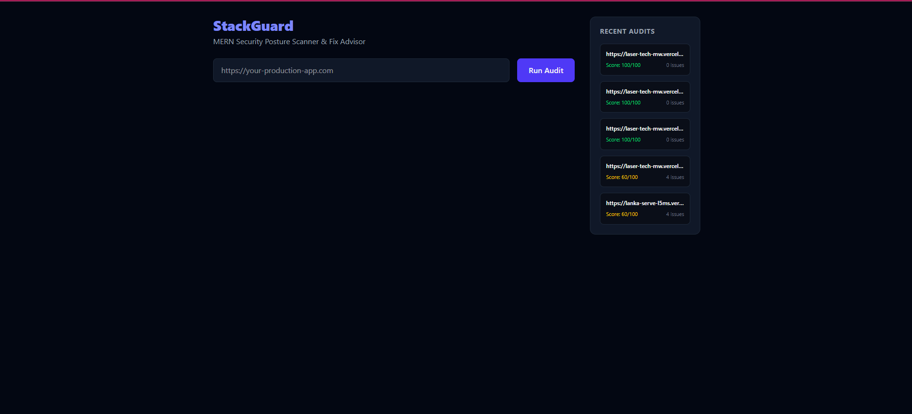
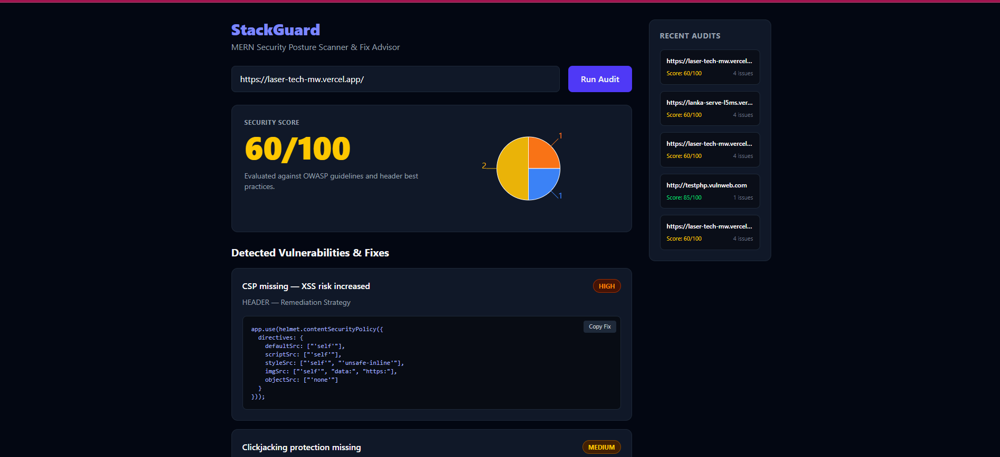
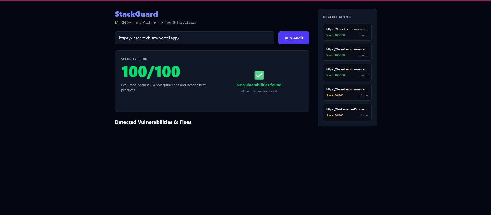
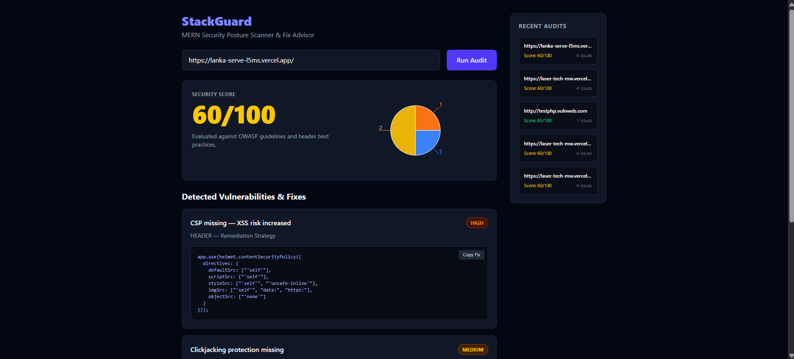

# 🛡️ StackGuard

**MERN Security Posture Scanner & Fix Advisor**

A full-stack security auditing tool that inspects live web applications for missing HTTP security headers and deprecated TLS configurations — and returns **exact, copy-pasteable remediation code** for every finding.



---

## 📌 What It Does

- **HTTP header auditing** — detects missing Content-Security-Policy, Strict-Transport-Security, X-Frame-Options, X-Content-Type-Options, Referrer-Policy, and Permissions-Policy
- **Transport security** — flags deprecated TLS 1.0 / 1.1 via Node's `tls` module
- **Information disclosure** — detects exposed `X-Powered-By` tech stack headers
- **Fix advisor** — returns ready-to-paste Helmet.js / Next.js remediation code for every finding, with one-click copy
- **Severity scoring** — calculates a 0–100 security score using OWASP-aligned severity weights
- **Scan history** — keeps the last 5 audits in-memory for quick comparison

> **Note:** This is a passive scanner. It sends a single `GET` request per target and inspects the response. It does not exploit, brute-force, or send malicious payloads.

---

## 📊 Real-World Validation

StackGuard was validated against a production Next.js application ([Laser Tech](https://laser-tech-mw.vercel.app)) before and after applying its own recommendations.

### Before — 60/100, 4 findings



Findings: 1 High (CSP missing), 2 Medium (clickjacking, MIME sniffing), 1 Low (referrer leakage).

### After — 100/100, 0 findings


**Fix applied:** 7 lines added to `next.config.ts` using Next.js's native `headers()` API:

```typescript
async headers() {
  return [{
    source: "/(.*)",
    headers: [
      { key: "Content-Security-Policy", value: "default-src 'self'; ..." },
      { key: "X-Frame-Options", value: "DENY" },
      { key: "X-Content-Type-Options", value: "nosniff" },
      { key: "Referrer-Policy", value: "strict-origin-when-cross-origin" },
      { key: "Strict-Transport-Security", value: "max-age=63072000; includeSubDomains; preload" },
      { key: "Permissions-Policy", value: "camera=(), microphone=(), geolocation=(), payment=()" },
    ],
  }];
}
```
### Findings & Fixes view



### Cross-validation

The same four findings were independently detected on [LankaServe](https://lanka-serve-l5ms.vercel.app), a production MERN marketplace — confirming detection consistency across Express and Next.js stacks.

Third-party validation was also performed against [testphp.vulnweb.com](http://testphp.vulnweb.com) (a deliberately vulnerable public target used for security testing), scoring **85/100 with 1 finding**.

---

## 🏗️ Architecture

```text
┌─────────────────┐      POST /api/scan      ┌──────────────────────┐
│                 │ ──────────────────────► │                      │
│  React Frontend │                         │  Express API         │
│  (Vite + TW)    │ ◄──── JSON results ──── │                      │
│                 │                         │  ┌────────────────┐  │
└─────────────────┘                         │  │  scanner.js    │  │
                                            │  │  ├─ checkHeaders│──┼──► axios.get()
                                            │  │  └─ checkTLS    │──┼──► tls.connect()
                                            │  └────────────────┘  │
                                            │  ┌────────────────┐  │
                                            │  │ fixes (inline)  │  │
                                            │  │ remediation    │  │
                                            │  └────────────────┘  │
                                            └──────────────────────┘

```

Key design decisions:

Passive scanning only — one GET request per target, no exploit payloads. Legal to run against any URL you own.

No database dependency — scan history is held in-memory for zero-config deployment.

Remediation-first design — every finding ships with its fix already attached.

🛠️ Tech Stack
Frontend

React 19 + Vite

Tailwind CSS v4

Recharts (severity distribution visualization)

Axios

Backend

Node.js + Express 5

Node tls module (raw TLS protocol inspection)

Axios (HTTP header inspection)

Deployment

Frontend: Vercel

Backend: Node runtime (local or any VPS)
